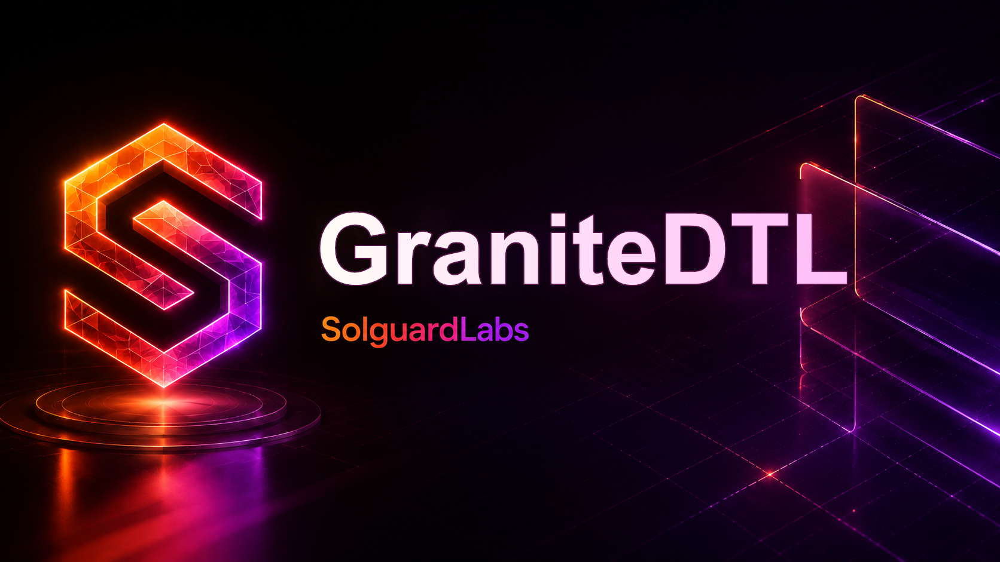

# GraniteDTL



GraniteDTL es un motor C++ para garantias bloqueadas en operaciones DTL de
larga duracion. Modela collateral, reservas, locks temporales, expiraciones,
penalizaciones, ratios de cobertura, liquidaciones y reportes JSON
deterministas para ejercicios de auditoria.

El lab es autocontenido: no usa red, base de datos ni claves reales. Los
escenarios cargan cuentas, posiciones y reservas dentro del proceso y permiten
reproducir transiciones desde la CLI o desde scripts `.gdtl`.

## Componentes

- `src/engine.*`: coordinacion contable de cuentas, vault, posiciones y cierres.
- `src/risk.*`: calculo de cobertura, colateral requerido, surplus y shortfall.
- `src/locks.*`: expiraciones, grace period y penalizaciones acumuladas.
- `src/audit.*`: resumen por posicion, cuenta y lane.
- `src/portfolio.*`: buckets de vencimiento y exposicion por owner.
- `src/planner.*`: acciones operativas sugeridas para locks abiertos.
- `src/script.*`: parser de escenarios `.gdtl`.
- `src/json.*`: salida JSON estable para tests y revisiones.
- `tests/node`: tests de integracion contra el binario compilado.

## Uso

Compilar:

```bash
node scripts/build.mjs
```

Listar escenarios:

```bash
build/granitedtl --list
```

Ejecutar escenarios:

```bash
build/granitedtl baseline
build/granitedtl surplus-release
build/granitedtl expiry
build/granitedtl default
build/granitedtl liquidation
build/granitedtl maintenance
```

Ejecutar un script:

```bash
build/granitedtl script examples/healthy.gdtl
```

Tests:

```bash
node --test --test-concurrency=1 "tests/node/*.test.js"
```

Pipeline completo:

```bash
node scripts/ci.mjs
```

En PowerShell, si `npm.ps1` esta bloqueado por execution policy, usa
`node scripts/ci.mjs` o `npm.cmd run ci`.

## Scripts `.gdtl`

Comandos principales:

```text
SCENARIO <name>
RESET
EMPTY
ACCOUNT <id> <label> <cash>
RESERVE <amount> [detail]
OPEN <id> <owner> <counterparty> <collateral> <debt> <ttl> <penalty_bps> <lane> [parent]
ADVANCE <delta>
REFRESH <position>
PENALTY <position>
RELEASE <position>
COMPLETE <position>
SETTLE <position>
LIQUIDATE <position>
WITHDRAW <account> <amount>
MAINTAIN
POLICY <key> <value>
RUN <scenario>
TRY_<COMMAND> ...
```

`TRY_*` mantiene vivo el script aunque el comando rechace. Es util para probar
errores esperados sin abortar el reporte.

## Salida JSON

Cada ejecucion devuelve:

- `policy`, `vault`, `accounts`, `positions` y `risk_views`;
- `events` y `journal` para reconstruir la secuencia;
- `audit`, `portfolio` y `plan` para analisis operativo;
- `checks` e `invariants` para validaciones de conservacion y cobertura;
- `last_error` cuando el escenario contiene un rechazo esperado.

## Requisitos

- Node.js 20 o superior.
- Compilador C++17:
  - Linux/macOS: `c++`, `g++` o `clang++`.
  - Windows: Visual Studio Build Tools con C++ o un GCC/Clang en `PATH`.

El script de build busca `CXX`, compiladores en `PATH` y MSVC mediante
`vcvars64.bat`.

## Estado

GraniteDTL es un laboratorio CTF. No debe usarse como motor financiero real sin
redisenar persistencia, autenticacion, concurrencia, manejo de overflow,
observabilidad y controles independientes.
