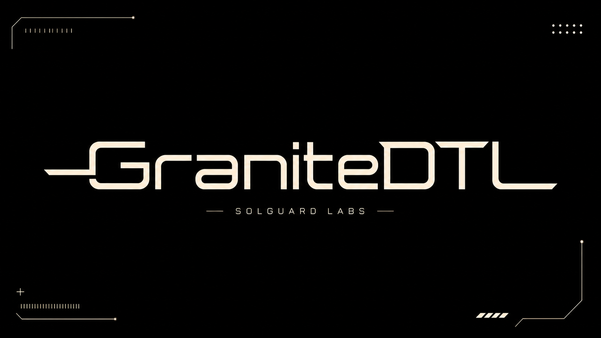
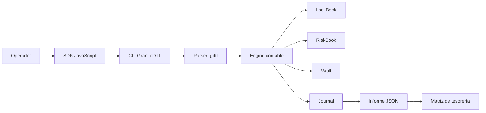
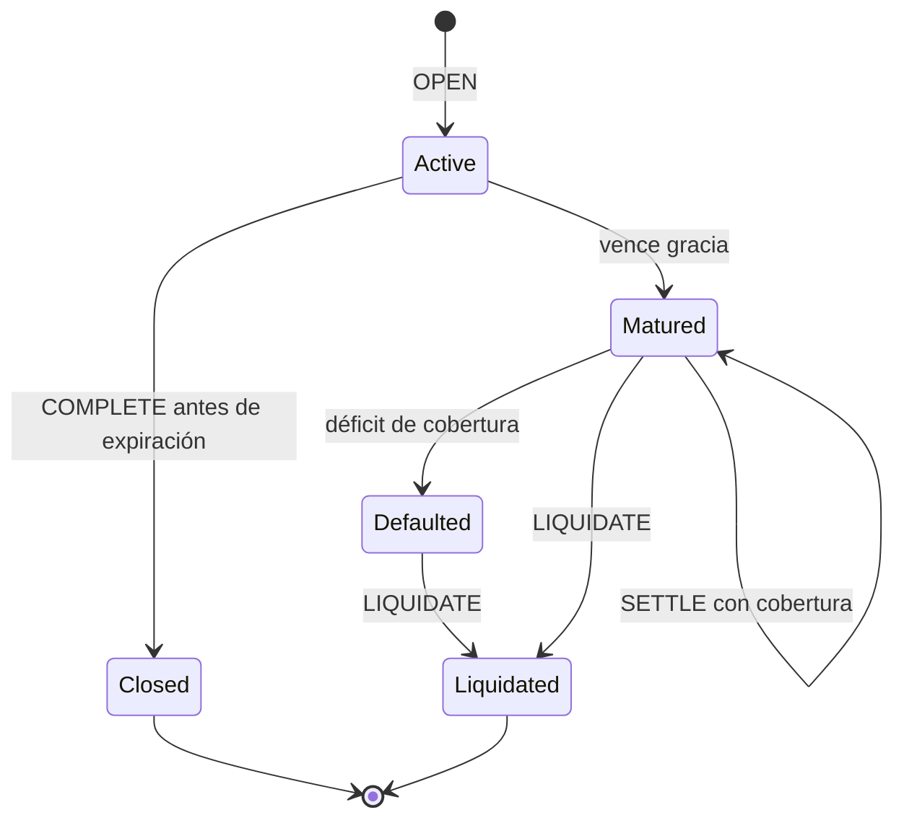
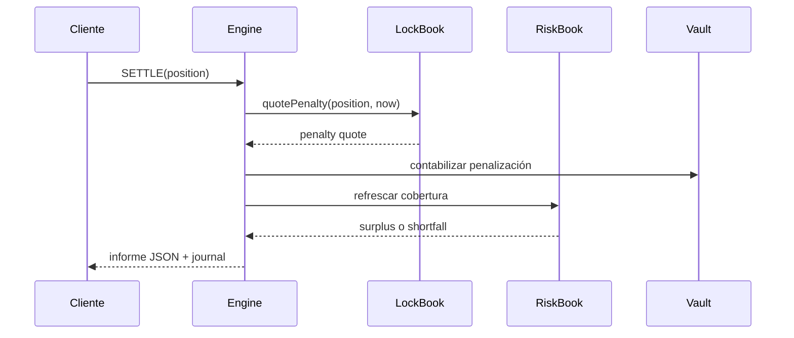
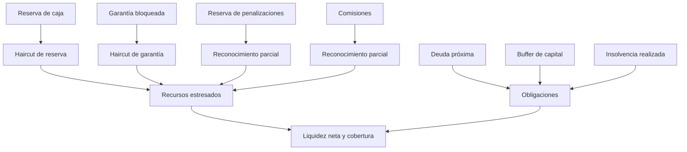

# GraniteDTL



[](https://github.com/SolguardLabs/GraniteDTL/actions/workflows/ci.yml)
[](https://github.com/SolguardLabs/GraniteDTL/releases)
[](https://isocpp.org/)
[](https://nodejs.org/)

GraniteDTL es un motor determinista de garantías para obligaciones comerciales
de larga duración. Coordina depósitos bloqueados, vencimientos, penalizaciones,
cobertura, liquidación de posiciones y reservas de tesorería mediante una CLI
C++17 y un SDK JavaScript sin dependencias de ejecución.

La versión `1.0.0` prioriza aritmética entera, resultados JSON estables y una
separación explícita entre ejecución contable, observación de riesgo y análisis
de liquidez. Cada transición deja un evento secuenciado y puede reconstruirse
desde el journal.

## Arquitectura


```mermaid
flowchart LR
    O["Operador"] --> SDK["SDK JavaScript"]
    SDK --> CLI["CLI GraniteDTL"]
    CLI --> PARSER["Parser .gdtl"]
    PARSER --> ENG["Engine contable"]
    ENG --> LOCK["LockBook"]
    ENG --> RISK["RiskBook"]
    ENG --> VAULT["Vault"]
    ENG --> JOURNAL["Journal"]
    JOURNAL --> REPORT["Informe JSON"]
    REPORT --> STRESS["Matriz de tesorería"]
```

| Componente | Responsabilidad                                | Entrada principal         | Salida              |
| ---------- | ---------------------------------------------- | ------------------------- | ------------------- |
| `engine`   | Transiciones de cuentas, posiciones y vault    | comandos validados        | eventos y estado    |
| `locks`    | Vencimiento, gracia y penalización incremental | posición, política, reloj | cotización temporal |
| `risk`     | Cobertura, garantía requerida y déficit        | deuda y garantía          | `CoverageView`      |
| `treasury` | Escenarios de liquidez y concentración         | balance agregado          | cuatro proyecciones |
| `journal`  | Orden causal y métricas de eventos             | secuencia de eventos      | resumen verificable |
| `sdk`      | Ejecución acotada y validación del informe     | escenario o archivo       | objeto inmutable    |

## Ciclo de una posición


```mermaid
stateDiagram-v2
    [*] --> Active: OPEN
    Active --> Closed: COMPLETE antes de expiración
    Active --> Matured: vence gracia
    Matured --> Matured: SETTLE con cobertura
    Matured --> Defaulted: déficit de cobertura
    Defaulted --> Liquidated: LIQUIDATE
    Matured --> Liquidated: LIQUIDATE
    Closed --> [*]
    Liquidated --> [*]
```

La apertura exige una cobertura mínima:

```text
garantía_requerida = ceil(deuda × cobertura_mínima_bps / 10.000)
cobertura_bps = floor(garantía × 10.000 / deuda)
surplus = max(garantía - garantía_requerida, 0)
shortfall = max(garantía_requerida - garantía, 0)
```

Las cantidades usan enteros de 64 bits con comprobaciones de suma,
multiplicación y división. El protocolo no utiliza coma flotante para decisiones
económicas.

## Liquidación


```mermaid
sequenceDiagram
    participant C as Cliente
    participant E as Engine
    participant L as LockBook
    participant R as RiskBook
    participant V as Vault
    C->>E: SETTLE(position)
    E->>L: quotePenalty(position, now)
    L-->>E: penalty quote
    E->>V: contabilizar penalización
    E->>R: refrescar cobertura
    R-->>E: surplus o shortfall
    E-->>C: informe JSON + journal
```

La penalización objetivo se calcula sobre la garantía original y solo se carga
el incremento pendiente:

```text
atraso = now - due_at - grace_period
bps_efectivos = min(bps_base + atraso × bps_diarios, bps_máximos)
penalización_objetivo = floor(garantía_original × bps_efectivos / 10.000)
incremento = max(penalización_objetivo - penalización_acumulada, 0)
```

## Modelo de tesorería

El informe incorpora cuatro escenarios: `base`, `liquidity-squeeze`,
`collateral-drawdown` y `combined`. Cada uno aplica haircuts y buffers diferentes
sin modificar el ledger.


```mermaid
flowchart TD
    RC["Reserva de caja"] --> HR["Haircut de reserva"]
    LC["Garantía bloqueada"] --> HC["Haircut de garantía"]
    PR["Reserva de penalizaciones"] --> RP["Reconocimiento parcial"]
    FE["Comisiones"] --> RF["Reconocimiento parcial"]
    HR --> RES["Recursos estresados"]
    HC --> RES
    RP --> RES
    RF --> RES
    MD["Deuda próxima"] --> OBL["Obligaciones"]
    BF["Buffer de capital"] --> OBL
    INS["Insolvencia realizada"] --> OBL
    RES --> NET["Liquidez neta y cobertura"]
    OBL --> NET
```

La concentración se calcula como la deuda de la mayor lane dividida por la
deuda abierta. La banda resultante es `resilient`, `guarded`, `constrained` o
`deficit`.

## Inicio rápido

Requisitos:

- Node.js 24 y npm 11;
- compilador C++17: GCC, Clang o MSVC con herramientas x64;
- Git para validar la integridad de la entrega.

```bash
npm ci
npm run build
build/granitedtl baseline
npm test
```

En Windows el ejecutable se genera como `build/granitedtl.exe`. El build busca
primero `CXX`, después compiladores disponibles en `PATH` y finalmente
`vcvars64.bat`.

### Cliente JavaScript

```js
import { GraniteClient } from "granite-dtl";

const client = new GraniteClient({ timeoutMs: 5_000 });
const report = client.runScenario("baseline");

console.log(report.checks.accounting_ok);
console.log(report.treasury_stress.scenarios);
```

### Escenario declarativo

```text
SCENARIO settlement-day
EMPTY
POLICY min_coverage_bps 15000
ACCOUNT operator Operator 2500000
ACCOUNT merchant Merchant 100000
RESERVE 900000 seed
OPEN position-01 operator merchant 1650000 1000000 8 600 lane-a
ADVANCE 2
REFRESH position-01
```

```bash
build/granitedtl script examples/healthy.gdtl
```

## Contrato de salida

El objeto raíz contiene `policy`, `vault`, `accounts`, `positions`,
`risk_views`, `events`, `checks`, `audit`, `journal`, `invariants`, `portfolio`,
`plan` y `treasury_stress`. El SDK valida estas secciones y congela
recursivamente el resultado.

## Calidad y publicación

```bash
npm run ci
```

El pipeline ejecuta análisis JavaScript, build C++ con warnings como errores,
19 pruebas de integración, formato, auditoría de dependencias y verificación de
la entrega. GitHub Actions reproduce el proceso en Ubuntu y Windows para pull
requests, `main`, `production` y tags `v*`.

La política de reporte responsable se encuentra en [SECURITY.md](./SECURITY.md).
La documentación técnica está en [docs/](./docs/arquitectura.md).

## Licencia

Este repositorio se distribuye bajo los términos de [LICENSE](./LICENSE).
