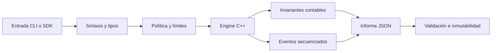
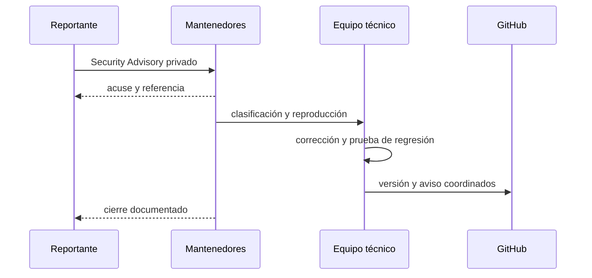

# Política de seguridad

GraniteDTL trata la seguridad como una propiedad verificable del ciclo completo:
entrada, transición contable, observación, publicación y respuesta operativa.
Esta política define versiones soportadas, límites de confianza y un proceso de
comunicación responsable.

## Versiones soportadas

| Versión   | Estado           | Actualizaciones de seguridad |
| --------- | ---------------- | ---------------------------- |
| `1.0.x`   | Soportada        | Sí                           |
| `< 1.0.0` | Fuera de soporte | No                           |

## Límites de confianza

- La CLI acepta únicamente comandos registrados y cantidades enteras.
- El SDK ejecuta sin shell, con timeout y límite de salida.
- El engine rechaza importes negativos, duplicados y cobertura inicial
  insuficiente.
- El informe compara fondos computados con entradas menos retiradas.
- La matriz de tesorería es observacional: no puede escribir en el ledger.

## Controles por capa

| Capa       | Control                                    | Resultado esperado       |
| ---------- | ------------------------------------------ | ------------------------ |
| Build      | C++17, `-Wall -Wextra -Werror` o `/W4 /WX` | compilación cerrada      |
| Entrada    | parser estricto y comandos enumerados      | rechazo determinista     |
| Aritmética | helpers comprobados, basis points enteros  | sin coma flotante        |
| Estado     | journal monotónico e invariantes           | transición reconstruible |
| Cliente    | `spawnSync` sin shell y JSON validado      | frontera acotada         |
| Entrega    | hashes, versión, estructura y refs         | artefacto reproducible   |

## Gestión de incidentes

No abras un issue público con detalles técnicos sensibles. Utiliza la pestaña
**Security** del repositorio y crea un aviso privado. Incluye:

1. versión, commit y plataforma;
2. precondiciones y secuencia mínima;
3. impacto observable y límites conocidos;
4. salida relevante sin secretos;
5. propuesta de prueba de regresión, si existe.

Los mantenedores confirmarán recepción, evaluarán severidad y coordinarán la
publicación. No se promete una fecha fija antes de completar la reproducción.

## Operación segura

- Ejecuta únicamente escenarios y datos bajo tu control.
- No incorpores credenciales, claves privadas ni información personal.
- Conserva los informes y journals necesarios para auditoría.
- Fija versiones con `npm ci` y valida el tag antes de distribuir artefactos.
- Revisa los límites de concentración y cobertura antes de cambiar políticas.
- Mantén `main`, `production` y el tag de la versión en el mismo commit
  aprobado.

## Alcance

Se aceptan reportes sobre aritmética, transiciones de estado, garantías,
reservas, penalizaciones, liquidación, parser, serialización, SDK, build e
integridad de publicación. La infraestructura de terceros y el comportamiento
de compiladores no soportados quedan fuera del alcance de este repositorio.
