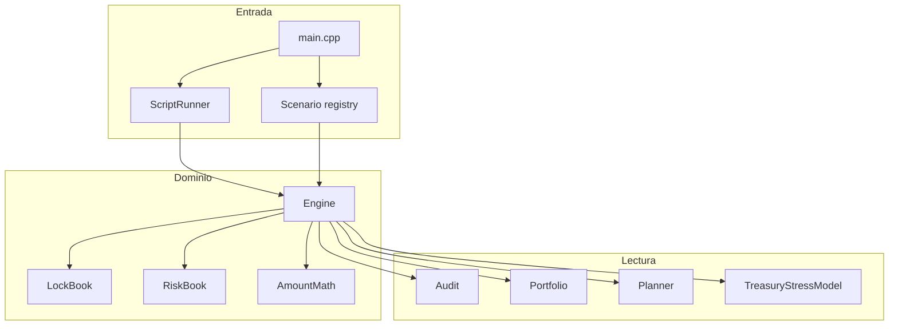
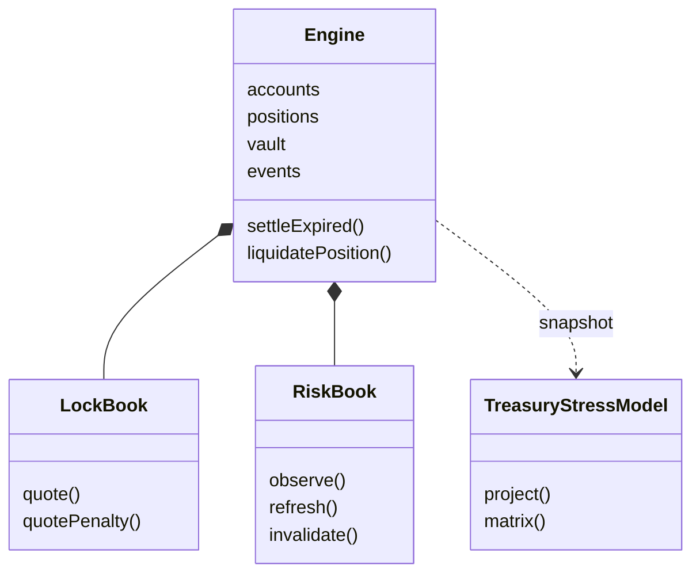
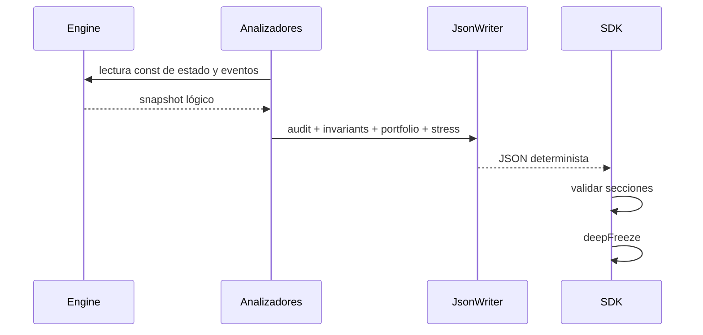

# Arquitectura de GraniteDTL

## Objetivo

GraniteDTL separa el procesamiento de comandos, el estado contable y las vistas
analíticas. El ejecutable es una unidad de despliegue, pero sus componentes
mantienen contratos explícitos para facilitar revisión, pruebas y evolución.

## Estado autoritativo

El `Engine` posee cuentas, posiciones, vault, reloj, eventos y flujos externos.
`RiskBook` conserva vistas derivadas; una vista no es una fuente de fondos ni
una autorización de movimiento. `TreasuryStressModel` recibe un agregado y
produce proyecciones puras.

| Estado              | Propietario           | Mutabilidad    | Persistencia            |
| ------------------- | --------------------- | -------------- | ----------------------- |
| cuentas             | `Engine`              | por comando    | informe final           |
| posiciones          | `Engine`              | por transición | informe final           |
| vault               | `Engine`              | por transición | informe final           |
| vistas de cobertura | `RiskBook`            | refrescables   | informe final           |
| matriz de estrés    | `TreasuryStressModel` | ninguna        | calculada al serializar |
| journal             | `Engine`              | append-only    | informe final           |

## Flujo de lectura

La serialización construye primero resúmenes consistentes desde una referencia
constante al engine. Ningún escritor JSON puede mutar el estado. El SDK valida
la forma del objeto y lo congela recursivamente.

## Decisiones de diseño

- Los importes se representan con `std::int64_t` y utilidades comprobadas.
- Las políticas usan basis points; `10.000` representa el cien por cien.
- Los mapas ordenados estabilizan la serialización de cuentas y posiciones.
- Los eventos reciben una secuencia monotónica dentro de una ejecución.
- Los scripts no contienen lógica económica: traducen comandos al engine.
- El SDK no usa shell y limita tiempo y volumen de salida.

## Extensión

Una nueva transición debe definir validaciones, mutación, evento, actualización
de versión del vault e invariantes. Una nueva vista debe ser pura y añadirse al
informe sin otorgar capacidad de escritura.
