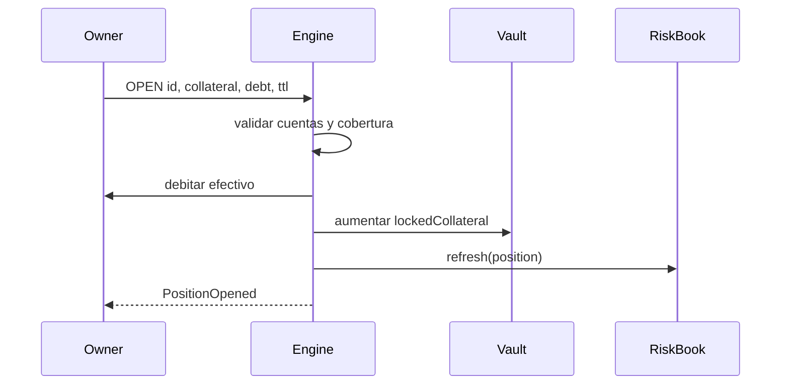
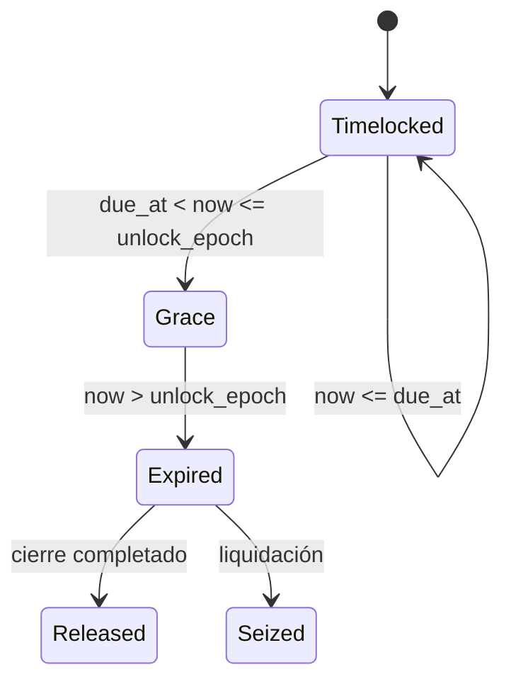
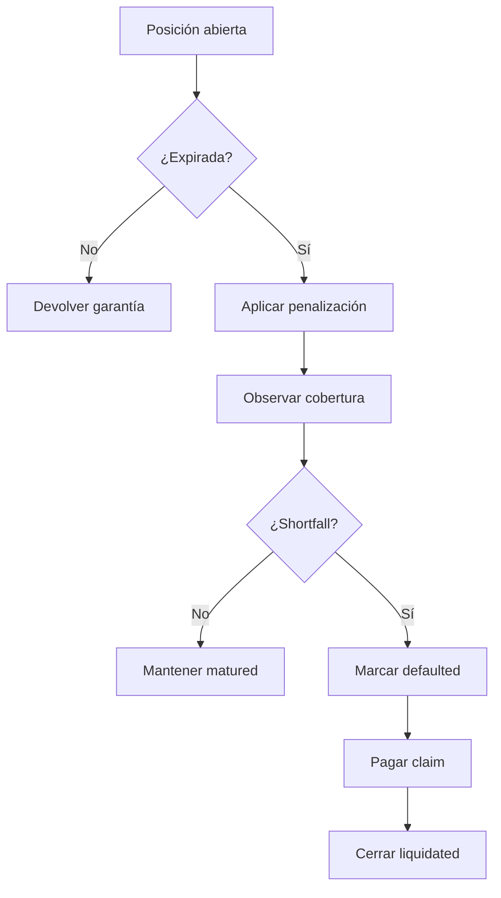

# Ciclo de garantías y vencimientos

## Apertura

`OPEN` valida identificadores, cuentas, importes, límite individual y cobertura
mínima. La garantía sale del efectivo del owner, entra en el vault como saldo
bloqueado y queda asociada a una posición única.



Los campos temporales se derivan del reloj lógico:

```text
due_at = opened_at + ttl
unlock_epoch = due_at + grace_period
```

## Evolución temporal

`ADVANCE` solo acepta deltas no negativos. Al avanzar, las posiciones activas
que superan vencimiento más gracia pasan a `matured` con lock `expired`.



El cambio temporal no transfiere fondos por sí mismo. Penalización, settlement y
liquidación son operaciones explícitas y dejan eventos separados.

## Cierre y liquidación

Una posición antes de expiración puede cerrarse devolviendo la garantía
remanente. Una posición vencida requiere settlement; si queda déficit, puede
liquidarse para pagar el claim con garantía y después con reserva de caja.



## Journal mínimo

Para reconstruir una posición se filtran eventos por `position` y se ordenan
por `seq`. La secuencia debe comenzar con `position_opened`; cada movimiento
monetario debe tener un evento, y una posición terminal no admite otra
transición económica.

Campos recomendados para conciliación:

- `original_collateral`, `collateral` y `penalty_accrued`;
- `surplus_released`, `release_fees` y `claim_paid`;
- `shortfall`, `state`, `lock_state` y `closed_at`;
- `vault.version` para correlacionar observaciones.

## Ejemplo

```bash
build/granitedtl script examples/maintenance.gdtl > report.json
```

Comprueba `checks.accounting_ok`, `journal.monotonic_sequence` e
`invariants.ok` antes de aceptar el resultado para conciliación.
