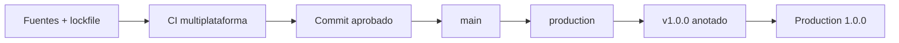
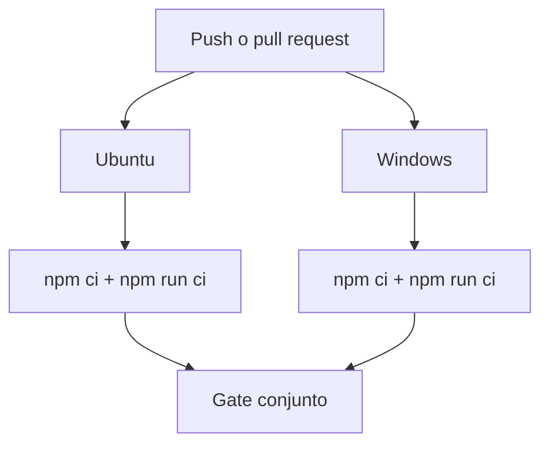
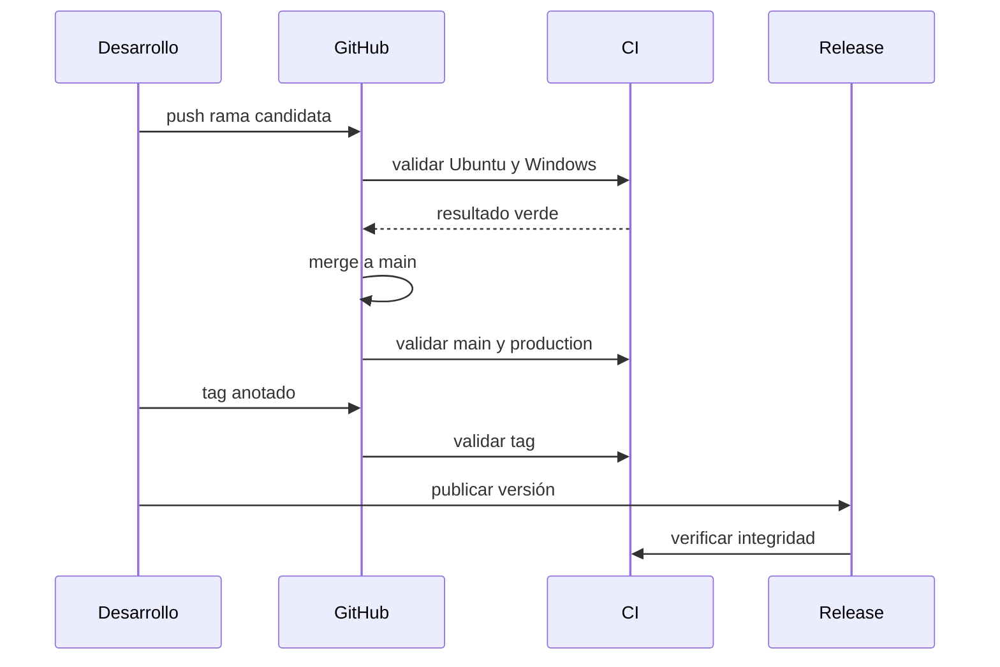

# Despliegue y publicación

## Artefacto

El artefacto ejecutable se compila desde todos los `.cpp` de `src/` con C++17.
La entrega incluye código fuente, lockfile npm, documentación, SDK, tests y
workflows; el directorio `build/` no se versiona.



## Matriz de compilación

| Plataforma | Toolchain | Flags principales                      |
| ---------- | --------- | -------------------------------------- |
| Ubuntu     | `g++`     | `-std=c++17 -Wall -Wextra -Werror -O2` |
| Windows    | MSVC x64  | `/std:c++17 /W4 /WX /O2`               |



El pipeline no depende de un binario precompilado. Cada runner genera el suyo y
ejecuta los mismos contratos Node contra ese resultado.

## Secuencia de publicación

1. crear una rama `release/production-1.0.0` desde `main`;
2. ejecutar `npm ci` y `npm run ci` localmente;
3. abrir pull request y esperar ambos sistemas operativos;
4. integrar sin alterar el historial aprobado;
5. apuntar la rama exacta `production` al commit de `main`;
6. crear el tag anotado `v1.0.0` sobre ese mismo commit;
7. publicar el release `Production 1.0.0`;
8. comprobar referencias y contenido de forma independiente.



## Verificación

```bash
npm ci
npm run ci
git rev-parse main
git rev-parse production
git rev-parse v1.0.0^{}
```

Los tres SHAs deben ser idénticos. El verificador también comprueba versión,
banner, documentación, diagramas, archivos protegidos y términos públicos.

## Rollback

No muevas un tag publicado. Si la entrega debe retirarse, marca el release como
no recomendado, crea un commit correctivo y publica una nueva versión. Conserva
la referencia anterior para trazabilidad.
