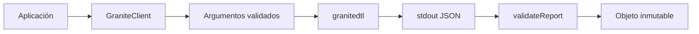
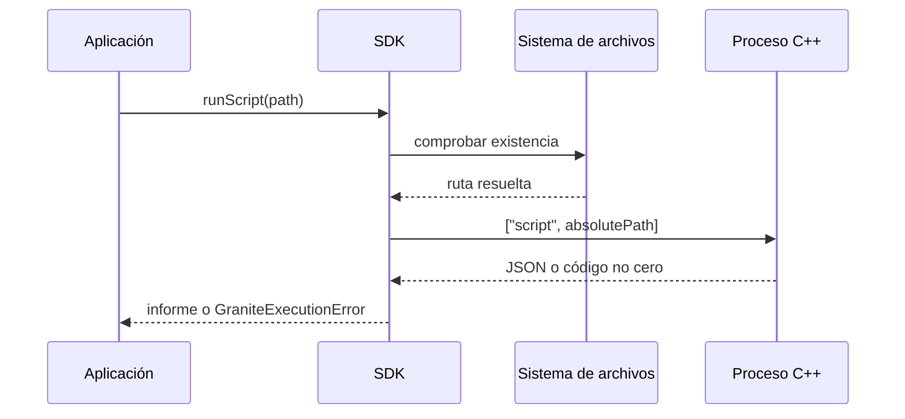
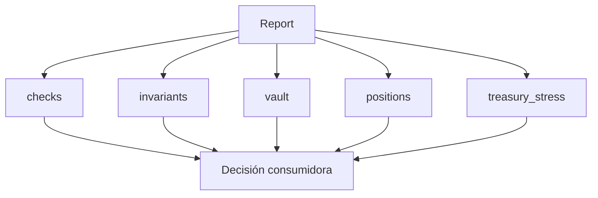

# Integración con CLI y SDK

## Contratos de entrada

La CLI ofrece escenarios registrados y ejecución de archivos `.gdtl`. El SDK
JavaScript envuelve el proceso con argumentos directos, timeout y límite de
buffer; no interpola comandos en una shell.



```js
import { GraniteClient } from "granite-dtl";

const client = new GraniteClient({
  timeoutMs: 5_000,
  maxBuffer: 8 * 1024 * 1024,
});

const report = client.runScenario("maintenance");
if (!report.checks.accounting_ok) {
  throw new Error("conciliación rechazada");
}
```

## Ejecución de archivos



Los errores incluyen contexto estructurado y no exponen automáticamente el
contenido del archivo. La aplicación consumidora decide qué información puede
registrar.

## Esquema de salida

| Sección           | Uso                                 |
| ----------------- | ----------------------------------- |
| `policy`          | parámetros económicos activos       |
| `vault`           | reservas, fondos bloqueados y pagos |
| `positions`       | estado por obligación               |
| `events`          | secuencia causal completa           |
| `checks`          | conservación y límites básicos      |
| `invariants`      | coherencia transversal              |
| `portfolio`       | exposición agrupada                 |
| `plan`            | acciones operativas derivadas       |
| `treasury_stress` | escenarios de liquidez              |



## Compatibilidad

Los consumidores deben tolerar campos nuevos y exigir únicamente las secciones
documentadas. Un cambio incompatible requiere nueva versión mayor. Los importes
JSON son enteros; no los conviertas a unidades decimales antes de completar las
comparaciones contables.

## Errores

`GraniteExecutionError` diferencia binario ausente, fallo de proceso y JSON no
válido. Los nombres de escenario se validan antes de ejecutar. Para servicios,
aplica además límites de concurrencia, aislamiento de directorio y cuotas de
CPU/memoria del sistema operativo.
