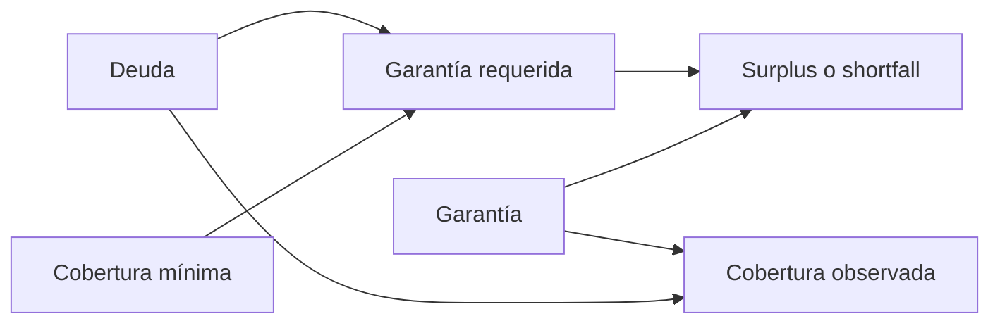
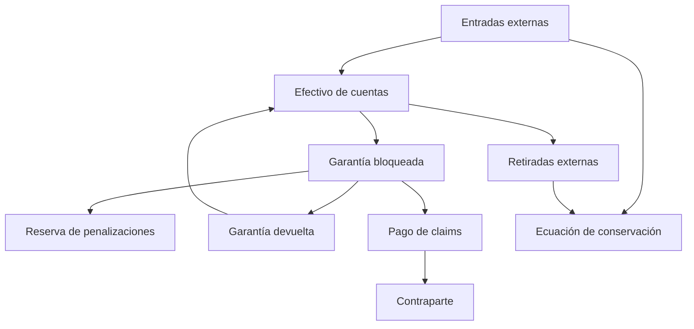
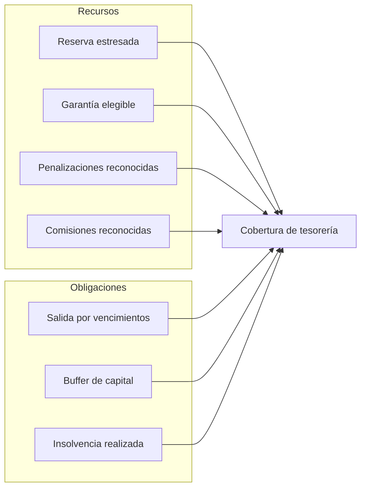

# Modelo económico y de tesorería

## Unidades y redondeo

GraniteDTL trabaja con la unidad mínima del activo de liquidación. Todas las
tasas se expresan en basis points y las multiplicaciones monetarias redondean
hacia abajo, salvo la garantía requerida, que redondea hacia arriba.

```text
required = ceil(debt × min_coverage_bps / 10.000)
fee = floor(amount × fee_bps / 10.000)
coverage_bps = floor(collateral × 10.000 / debt)
```



## Balance del sistema

El control contable compara todos los fondos internos con entradas externas
menos retiradas:

```text
fondos_sistema = efectivo_cuentas
               + garantía_posiciones
               + reserva_caja
               + reserva_penalizaciones
               + comisiones_sistema

fondos_computados = entradas_externas - retiradas_externas
accounting_ok = fondos_sistema == fondos_computados
```



## Penalizaciones

Tras el periodo de gracia, la tasa crece linealmente hasta el máximo de
política. La base es la garantía original, lo que evita que aplicaciones
repetidas cambien el objetivo total. Solo se contabiliza la diferencia frente a
la penalización ya acumulada.

Ejemplo con garantía `1.600.000`, tasa inicial `1.000 bps`, dos unidades de
atraso y `125 bps` diarios:

```text
tasa efectiva = 1.000 + 2 × 125 = 1.250 bps
objetivo = floor(1.600.000 × 1.250 / 10.000) = 200.000
```

## Matriz de estrés

La matriz reconoce recursos con descuentos diferenciados y obliga a reservar
liquidez para deuda próxima, insolvencia observada y buffer de capital.



| Escenario           | Haircut reserva | Haircut garantía | Runoff próximo | Buffer |
| ------------------- | --------------: | ---------------: | -------------: | -----: |
| base                |              0% |              15% |            85% |     5% |
| liquidity-squeeze   |             20% |              25% |           100% |     8% |
| collateral-drawdown |             10% |              45% |            95% |    12% |
| combined            |             35% |              65% |           100% |    18% |

La banda depende de cobertura y concentración. `deficit` exige un gap positivo;
las demás bandas distinguen margen y dependencia de una sola lane. Esta vista
sirve para límites operativos, no sustituye los controles de transición.
