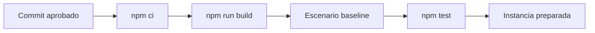
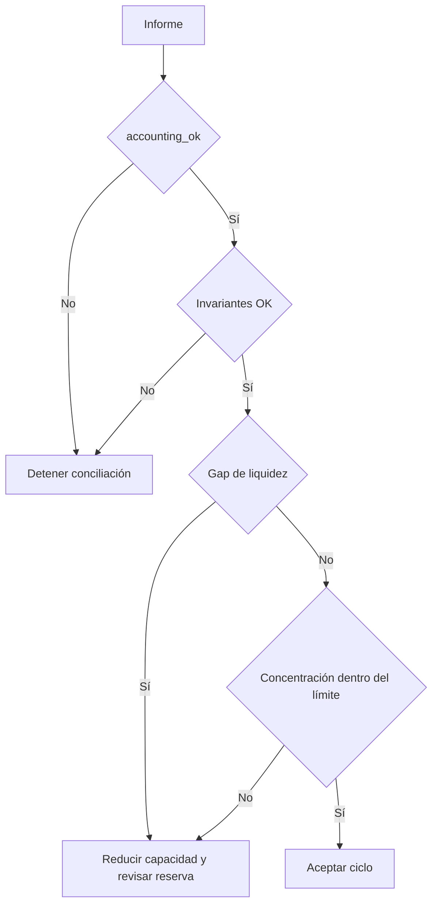
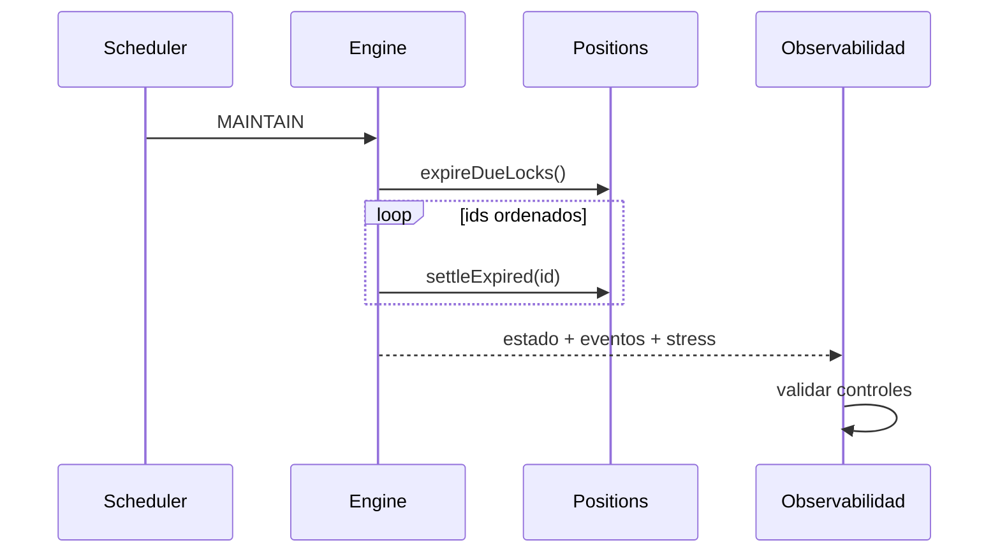

# Operaciones y observabilidad

## Procedimiento de arranque

Una ejecución operativa comienza desde dependencias fijadas, compila el binario
y registra el commit usado. No reutilices un ejecutable cuyo origen no pueda
demostrarse.



Comandos mínimos:

```bash
npm ci
npm run build
build/granitedtl baseline > baseline.json
npm test
```

## Señales operativas

| Señal         | Campo                            | Umbral de atención     |
| ------------- | -------------------------------- | ---------------------- |
| conservación  | `checks.accounting_ok`           | cualquier `false`      |
| secuencia     | `invariants.journal_sequence_ok` | cualquier `false`      |
| reserva       | `checks.reserve_floor_ok`        | cualquier `false`      |
| insolvencia   | `vault.insolvency`               | incremento no previsto |
| concentración | `lane_concentration_bps`         | límite de política     |
| liquidez      | `liquidity_gap`                  | valor mayor que cero   |



## Mantenimiento

`MAINTAIN` expira locks vencidos y procesa posiciones `matured` o `defaulted`
en orden determinista por identificador. Conserva el informe completo antes y
después de una ejecución de mantenimiento.



## Respuesta ante anomalías

1. conserva commit, comando, archivo de entrada e informe;
2. evita reejecutar sobre una copia no preservada;
3. compara la secuencia de eventos y la versión del vault;
4. identifica la primera divergencia contable;
5. reproduce con un escenario mínimo y datos sintéticos;
6. usa el canal privado definido en `SECURITY.md`.

## Recuperación

GraniteDTL no persiste estado entre procesos. La recuperación consiste en
reconstruir la ejecución desde un script versionado, verificar el hash del
binario y comparar la salida determinista. No edites manualmente un informe para
corregir una conciliación.
