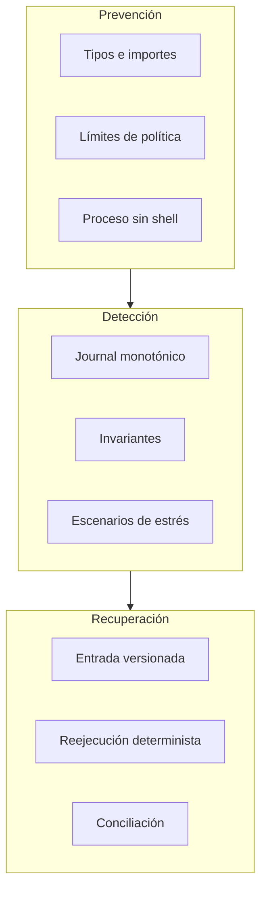
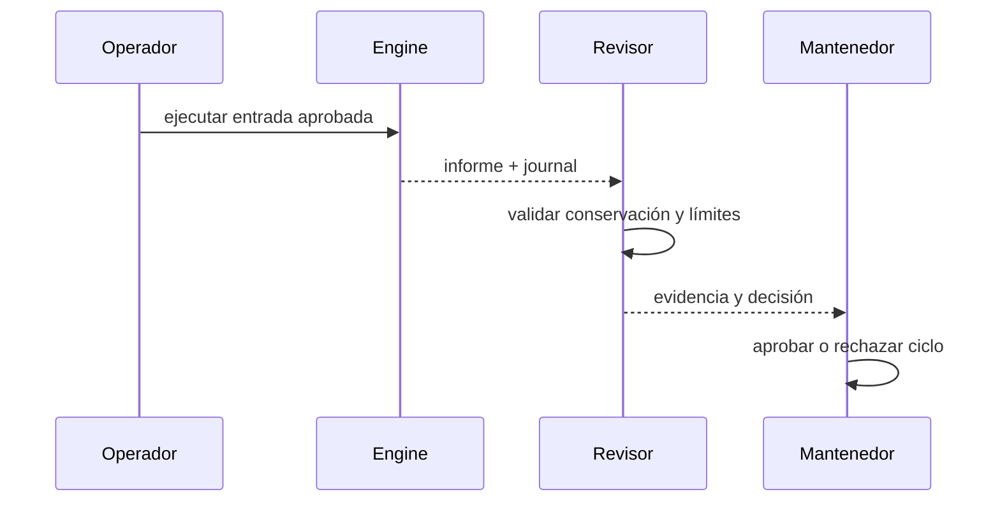
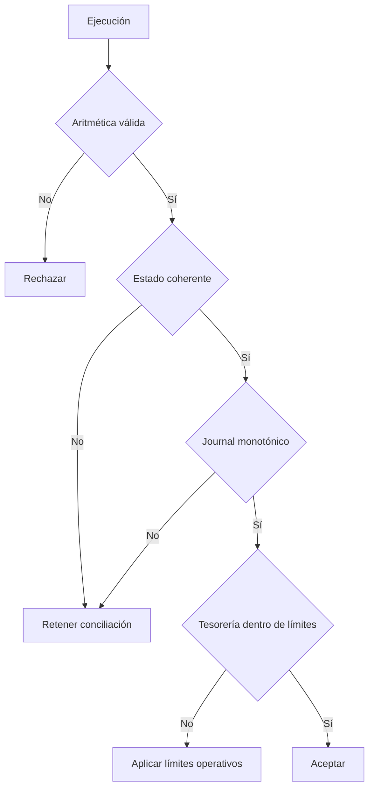

# Seguridad operativa

## Modelo de controles

Los controles se distribuyen entre prevención, detección y recuperación. Una
comprobación contable no sustituye a los límites de política, y una vista de
riesgo no autoriza movimientos por sí sola.

## Separación de responsabilidades

| Rol            | Puede                         | No debe                             |
| -------------- | ----------------------------- | ----------------------------------- |
| operador       | ejecutar escenarios aprobados | cambiar políticas sin revisión      |
| revisor        | validar journal e invariantes | modificar el informe                |
| mantenedor     | aprobar cambios y versiones   | omitir CI multiplataforma           |
| consumidor SDK | aplicar decisiones propias    | asumir que una vista muta el ledger |

## Invariantes de control

- ningún saldo de cuenta o posición puede ser negativo;
- la suma interna debe coincidir con entradas menos retiradas;
- la secuencia de eventos debe ser estrictamente creciente;
- los identificadores de posición deben ser únicos;
- los estados terminales no deben conservar acciones pendientes;
- la deuda próxima nunca puede superar la deuda abierta en la matriz;
- la deuda de la mayor lane nunca puede superar el total abierto.

## Gestión de entradas

Los archivos `.gdtl` deben almacenarse como texto UTF-8, revisarse por pares y
referenciar un objetivo concreto. Evita nombres ambiguos, cantidades sin unidad
y cambios de política mezclados con operaciones no relacionadas.

## Evidencia

Conserva:

- SHA del commit y versión del compilador;
- hash del archivo de entrada;
- stdout JSON original;
- resultado de CI y plataforma;
- decisión de aceptación o rechazo.

No almacenes credenciales en scripts, eventos o informes. Ante información
sensible, utiliza el canal privado descrito en `SECURITY.md`.
